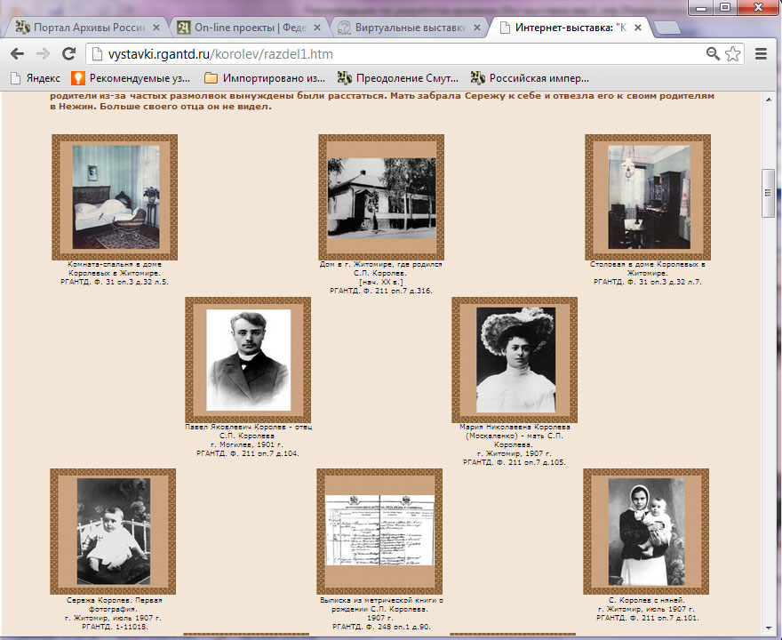
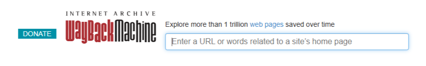
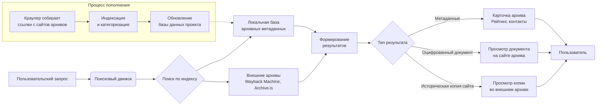

# 🕸️ Веб-Архив: Сохранение цифрового наследия

## Навигатор по проекту

*   **`/src/`** — Исходный код основных компонентов проекта (скрипты краулеров, движок поиска, веб-интерфейс).
*   **`/translations/`** — Файлы локализации для интерфейса проекта на разных языках.
*   **`/resources/`** — Ресурсы проекта: иконки, стили CSS, документация и справочные файлы.
*   **`/docs/`** — Полная техническая и пользовательская документация.

## Навигатор по документу
*   [О проекте](#о-проекте)
*   [Цель и задачи](#цель-и-задачи)
*   [Документация и файлы проекта](#документация-и-файлы-проекта)
*   [Пример кода](#пример-кода)
*   [Сравнение с аналогами](#сравнение-с-аналогами)
*   [Технический процесс](#технический-процесс)
*   [Развитие проекта](#развитие-проекта)

---

## О проекте

Проект **«Веб-Архив»** — это инициатива, направленная на *сохранение* и **систематизацию** цифрового исторического наследия, представленного в интернете. Мы объединяем разрозненные электронные ресурсы архивных учреждений, организуем по ним удобный поиск и делаем уникальные архивные документы более доступными для исследователей, историков и всех интересующихся подлинной историей.

> «Архивные документы отражают материальную, духовную жизнь общества и государства с XI века до наших дней, и задача архивистов не только сберечь эти ценности, но и рассказать нам о них».


*Пример виртуальной выставки документов.*

---

## Цель и задачи

Главная цель проекта — привлечь внимание граждан к деятельности архивов, повысить интерес к исторической информации и увеличить посещаемость архивных сайтов.

**Ключевые задачи:**
1.  Создание единого портала для поиска по архивным интернет-ресурсам.
2.  Развитие интерактивных сервисов на основе архивных данных (например, «Календарь памятных дат»).
3.  Оценка и повышение качества архивных сайтов через систему рейтингов.
4.  Налаживание обратной связи между архивами и пользователями.


*Сквозной поиск позволяет быстро определить местонахождение документов.*

---

## Документация и файлы проекта

Ниже представлен нумерованный список с ссылками на ключевые документы, сгруппированные по папкам проекта.

1.  **Исходный код (`/src/`)**
    *   [`crawler_engine.py`](/src/crawler_engine.py) — основной модуль краулера для сбора веб-страниц.
    *   [`search_index.py`](/src/search_index.py) — движок индексации и полнотекстового поиска.
    *   `frontend_app/` — директория с кодом веб-интерфейса пользователя.

2.  **Локализация (`/translations/`)**
    *   [`ru_RU.json`](/translations/ru_RU.json) — файл с переводами на русский язык.
    *   [`en_US.json`](/translations/en_US.json) — файл с переводами на английский язык.
    *   `de_DE.json` — файл с переводами на немецкий язык.

3.  **Ресурсы (`/resources/`)**
    *   [`user_manual.md`](/resources/user_manual.md) — руководство пользователя.
    *   [`api_documentation.md`](/resources/api_documentation.md) — техническое описание API.
    *   `icons/` — набор иконок и логотипов проекта.

---

## Пример кода

Для сохранения веб-страниц используется упрощенный скрипт на Python, который демонстрирует базовый принцип работы архиватора:

```python
import requests
from bs4 import BeautifulSoup
import hashlib
import datetime

def archive_webpage(url):
    """Функция для сохранения копии веб-страницы."""
    try:
        response = requests.get(url)
        response.raise_for_status()

        # Создание уникального ID на основе URL и даты
        timestamp = datetime.datetime.now().strftime("%Y%m%d_%H%M%S")
        page_hash = hashlib.md5(url.encode()).hexdigest()[:8]
        filename = f"{timestamp}_{page_hash}.html"

        # Сохранение HTML-контента
        with open(f"archived_pages/{filename}", 'w', encoding='utf-8') as f:
            f.write(response.text)

        print(f"Страница {url} успешно архивирована в файл {filename}")
        return filename

    except requests.exceptions.RequestException as e:
        print(f"Ошибка при загрузке {url}: {e}")
        return None

# Пример вызова функции
archive_webpage("https://example.com")
```

---

## Сравнение с аналогами

Существует несколько крупных проектов, занимающихся сохранением веб-контента. Ниже приведено их сравнение по ключевым параметрам.

| Сервис / Проект | Основная специализация | Объем архива | Уникальные особенности |
| :--- | :--- | :--- | :--- |
| **Wayback Machine (Archive.org)** | Глобальный архив всего интернета | **Более 400 млрд страниц** (крупнейший в мире) | Некоммерческий, универсальный, с историей с 1996 года. |
| **Архив Интернет (web-arhive.ru)** | Поиск архивных копий сайтов для юридических и ознакомительных целей | Не указан | Фокус на юридическую значимость, услуга нотариального заверения снимков. |
| **Archive.is (Archive.today)** | Сохранение конкретных страниц, в т.ч. из Web 2.0 (соцсети, карты) | Небольшой (проценты от Archive.org) | Может сохранять динамический контент, простой интерфейс. |
| **Google Кеш** | Быстрый кеш страниц для поисковой системы | Огромный, но недолговечный | Данные хранятся недолго (около месяца после удаления сайта). |
| **Наш проект «Web-archiv.RU»** | Архивы **России и ближнего зарубежья**, систематизация архивных ресурсов | Растет, фокус на качестве | Рейтинг архивных сайтов, календарь памятных дат, связь с архивами. |

---

## Технический процесс

На следующей диаграмме Mermaid показана упрощенная схема работы процесса архивации и доступа к данным в нашем проекте.



---

## Развитие проекта

Проект находится в активной фазе развития. Мы открыты для сотрудничества с архивными учреждениями, исследователями и волонтерами. В планах — создание новых сервисов, таких как шаблоны для виртуальных выставок и инструменты для профессиональной оценки личных цифровых архивов.

> «Данный проект призван... повысить интерес к исторической информации. Он создается по инициативе и на средства компании «Архивные Информационные Технологии».

---

**Присоединяйтесь к нам в сохранении истории!**  
*Ваши ссылки, предложения и участие помогут сделать проект лучше.*
